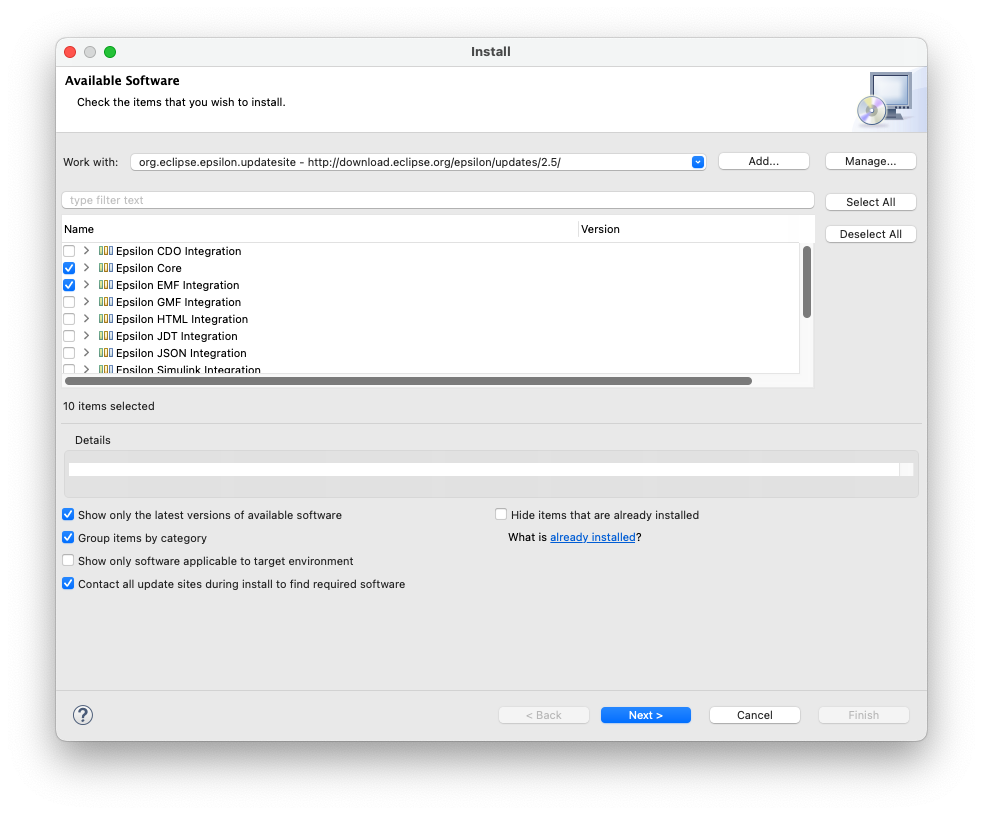
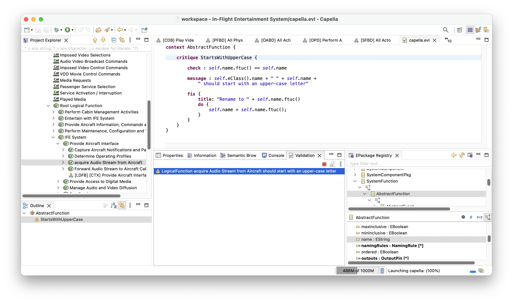
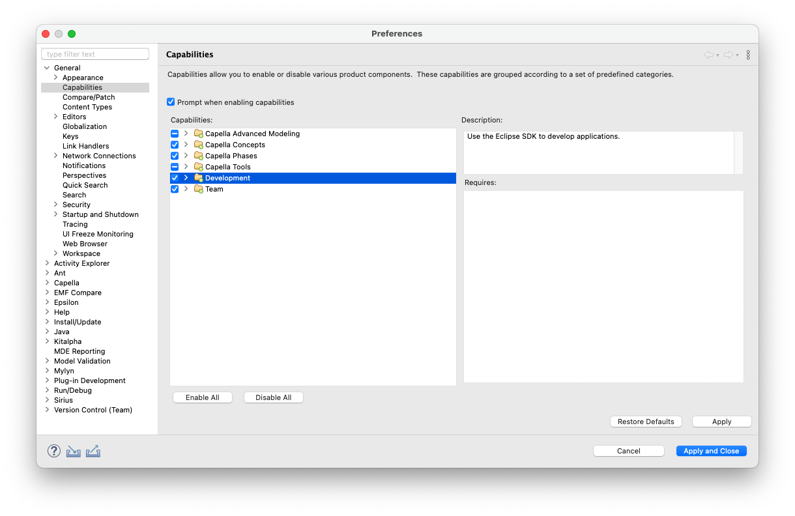

# Epsilon and Capella

[Capella](https://mbse-capella.org) is an industrial-grade MBSE workbench for systems, software and harware architects. As Capella is built on EMF and Sirius, Epsilon's [EMF driver](../index.md#epsilon-and-emf-models) can be used to query, validate and transform Capella models. To install Epsilon on top of Capella, you can use Epsilon's [update site](../../../download/index.md) and install (at least) the features under the `Epsilon Core` and `Epsilon EMF Integration` categories, as shown below.



You can then use Epsilon's languages to write validation constraints, transformations etc. as you would do with any EMF-based model. For example, the following [EVL](../../evl.md) critique checks that all functions (instances of `AbstractFunction`) in a Capella model start with an upper-case letter.

```evl
context AbstractFunction {
	
	critique StartsWithUpperCase {
	
		check : self.name.ftuc() == self.name
		
		message : self.eClass().name + " " + self.name + 
			" should start with an upper-case letter"
		
		fix {
			title: "Rename to " + self.name.ftuc()
			do {
				self.name = self.name.ftuc();
			}
		}
	}
}
```



To be able to run Epsilon programs such as the one above from Capella, you need to turn on the `Developers` capability from the `Preferences` dialog as shown below.

