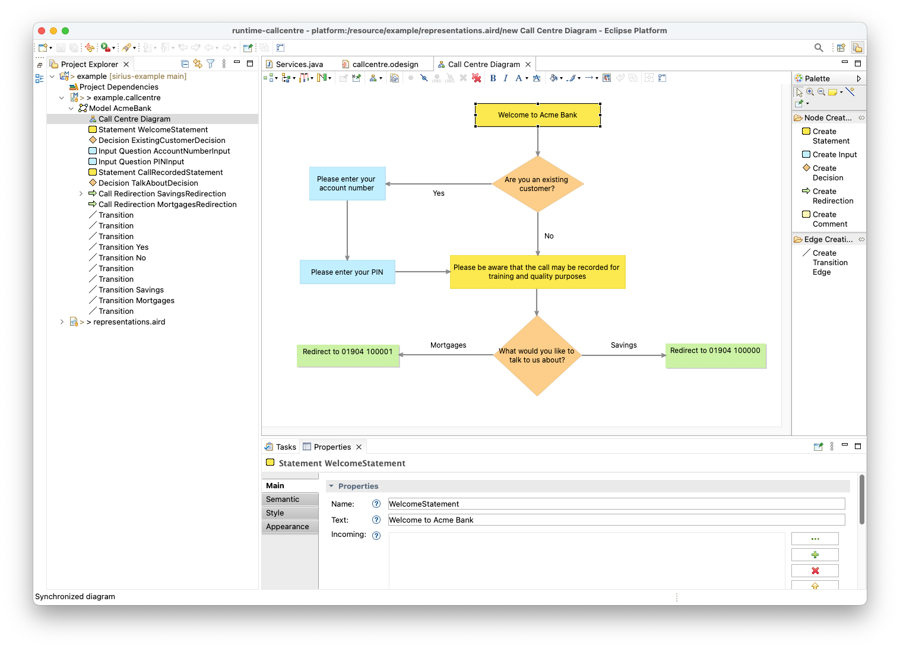
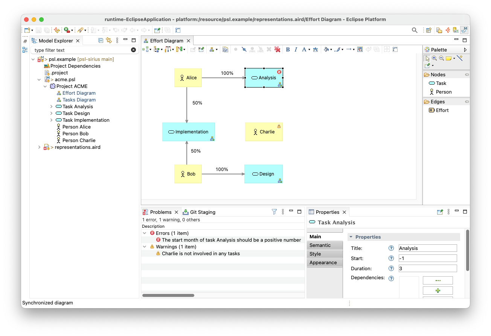

# Epsilon and Sirius

[Sirius](https://eclipse.dev/sirius) is a powerful and robust EMF-based framework for developing graphical editors for domain-specific languages. 
By default, Sirius-based editors store semantic model information in standard EMF XMI format that is agnostic of Sirius, and diagram information (e.g. positions and colours of diagram elements) in a separate Sirius-specific XMI-based model with a `.aird` file extension. For instance, with the [demo call centre menu editor](https://github.com/uoy-cs-eng2/callcentre-sirius/) shown below, the semantic model is saved in `example.callcentre` while the diagram information is stored in `representations.aird`. 



The semantic model (`example.callcentre`) can be read and written by Epsilon programs just like [any other EMF/XMI model](../epsilon-emf/index.md). For example, [this project](https://github.com/uoy-cs-eng2/callcentre-sirius?tab=readme-ov-file#generating-code-from-the-model) demonstrates running EVL validation rules and an EGL model transformation against call centre models created with the Sirius-based editor. You can get a flavour of the validation rules and transformation below.

=== "Code Generator (EGX)"

    ```egx
    rule Model2App 
        transform m : Model {

        template : "model2java.egl"

        parameters : Map{}

        target : m.name.toLowerCase() + "/" + m.name.ftuc() + ".java"
    }

    rule Decision2Java 
        transform d : Decision {

        template : "decision2java.egl"

        parameters : Map{
            "m" = d.eContainer()
        }

        target : d.getJavaFileName()
    }

    // ...

    operation Step getJavaFileName() {
        return self.eContainer.name.toLowerCase() + "/" + self.name.ftuc() + ".java";
    }
    ```

=== "decision2java.egl"

    ```egl
    package [%=m.name.toLowerCase()%];

    import java.util.Scanner;

    public class [%=d.name.ftuc()%] {
        
        public void run([%=m.name.ftuc()%] [%=m.name%]) {
            System.out.println("[%=d.text%]");
            
            [%for (t in d.outgoing){%]
            System.out.println("[%=loopCount%]. [%=t.text%]");
            [%}%]
            
            while (true) {
                String response = new Scanner(System.in).nextLine();
                [%for (t in d.outgoing){%]
                if (response.equals("[%=loopCount%]")) {
                    [%=m.name%].get[%=t.to.name.ftuc()%]().run([%=m.name%]);
                    return;
                }
                [%}%]
                System.out.println("Invalid option selected. Please select a valid option");
            }
            
        }
        
    }
    ```

=== "Validation Constraints (EVL)"

    ```evl
    context Decision {

        constraint AtLeastTwoOutgoing {

            check: self.outgoing.size() >= 2

            message: "Decision " + self.text + 
                " must have at least 2 outgoing" +
                " transitions"
        }
        
    }

    context Model {
        
        constraint OneEntryPoint {
        
            check : self.steps.select(s|s.incoming.isEmpty()).size() = 1
            
            message : "The model has mutliple entry points: " +
                self.steps.select(s|s.incoming.isEmpty()).text.concat(", ")
            
        }
    }
    ```

## Integrated Model Validation

Sirius reuses EMF's validation framework, with which EVL integrates. Therefore, as shown [here](https://github.com/uoy-cs-eng2/psl-sirius/?tab=readme-ov-file#model-validation), you can use EVL to define validation constraints for your language and run them to produce error/warning markers on your Sirius diagrams with [minimal configuration](https://github.com/uoy-cs-eng2/psl-sirius/blob/main/psl.validation/plugin.xml).

