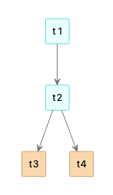
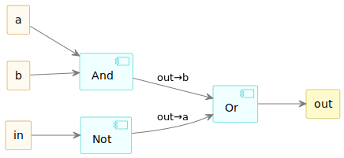
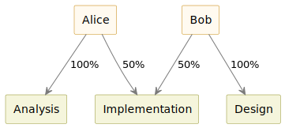
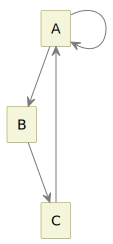

# Graphical Syntax Annotations

The Playground supports defining simple node–edge graphical syntaxes for models by adding annotations to their Emfatic metamodels. These annotations describe how model elements should be visualised in diagrams.

## Supported Annotations

The following annotations are supported to specify the graphical syntax of model elements.

- `@node`: Represent class instances as diagram nodes.
- `@edge`: Represent class instances or reference values as diagram edges.
- `@text`: Represent contained text inside supported node types.

!!! warning "Looking for metamodel diagram annotations?"

    The annotations discussed here are not to be confused with the [annotations that control the layout of the metamodel's class diagram](index.md#metamodel-diagram-annotations).

### @node

`@node` annotations can be attached to a **class** to specify that instances of the class should be displayed as nodes in the diagram. It supports the following attributes.

| Name | Description | Valid values | Default |
|-----|-----|-----|-----|
| `label` | Name of the attribute of the class to be used as the node label | Class attribute name | - |
| `shape` | Shape used to render the node | `rectangle`, `node`, `artifact`, `database`, `folder`, `object`, `hexagon`, `frame`, `cloud`, `component`, `file`, `package`, `queue`, `stack`, `storage`, `card`, `label`, `class` | `rectangle` |
| `image` | URL of an image used to represent the node | Valid image URL | - |
| `contents` | References whose values should appear inside the node | Comma-separated list of reference names | - |
| `color` | Background color of the node | [Any PlantUML-supported color](#colors) | Color of the class |
| `lineColor` | Color of the node border | [Any PlantUML-supported color](#colors) | Darker version of the node color |
| `created` | Whether a node is to be created for the element | `true`, `false` | `true` |
| `halign` | Horizontal alignment of the node label | `left`, `center`, `right` | `center` |
| `wrap` | Whether the node label text should wrap | `true`, `false` | `true` |
| `wrapLength` | Maximum length of wrapped lines | Integer | `30` |
| `preamble` | Additional PlantUML syntax added to the diagram preamble | Comma-separated PlantUML fragments | - |

The `@node` annotation also supports all the [style options offered by PlantUML](https://plantuml.com/style) (e.g. `@node(label="name", lineThickness="3")`). The names of the attributes are case-insensitive.

### @edge

`@edge` annotations can be attached to:

- a **class** to specify that instances of the class should be displayed as edges.
- **or** to a **reference** to specify that values of the reference should be displayed as edges.

The annotation supports the following attributes.

| Name | Description | Valid values | Default |
|-----|-----|-----|-----|
| `label` | If attached to a class, this is the name of the attribute of the class to be used as the edge's label. If attached to a reference, this is a literal string label. | Attribute name (class annotation) or string (reference annotation) | — |
| `source` | Name of the reference representing the source of the edge | Single-valued reference name | — |
| `target` | Name of the reference representing the target of the edge | Single-valued reference name | — |
| `thickness` | Thickness of the edge | Integer | — |
| `pattern` | Style of the edge | `solid`, `dashed`, `dotted` | `solid` |
| `color` | Color of the edge | [Any PlantUML-supported color](#colors) | — |
| `direction` | Direction in which the edge is drawn | `up`, `down`, `left`, `right` | — |
| `sourceDecoration` | Decoration at the source end of the edge | `none`, `arrow`, `arrow.filled`, `arrow.empty`, `diamond`, `diamond.empty` | `none` |
| `targetDecoration` | Decoration at the target end of the edge | `none`, `arrow`, `arrow.filled`, `arrow.empty`, `diamond`, `diamond.empty` | `none` |
| `created` | Whether an edge is to be created for the element | `true`, `false` | `true` |
| `visible` | Whether the edge is visible | `true`, `false` | `true` |
| `wrap` | Whether the edge label text should wrap | `true`, `false` | `true` |
| `wrapLength` | Maximum length of wrapped lines | Integer | `30` |

### @text

The `@text` annotation can be attached to a **class** to specify that instances of the class should be displayed as lines of text embedded in some other object. The annotation only supports a `label` attribute, which defines the name of the attribute of the class that acts as the label.

!!! info "Text element containers"

    `@text` elements can only be contained under `object` and `class` nodes.

## Dynamic Expressions with EOL

If the literal value of any of the annotation attributes above starts with `eol:`, the [EOL](../../eol.md) expression that follows it will be evaluated and the result will be returned as the value instead. For example, the `color` attribute specifies that the color of a tree node should be `wheat` for leaf nodes and `azure` for all other nodes.

```emf
package tree;

@node(label="label", color="eol: self.children.isEmpty() ? 'wheat' : 'azure'")
class Tree {
	attr String label;
    @edge
	val Tree[*]#parent children;
	ref Tree#children parent;
}
```

As a result, tree models conforming to the metamodel are visualised as shown below.



EOL expressions have access to the following variables:

- `self`: If the annotation is attached to a class it refers to the current instance of the class. If it is attached to a reference, it refers to the current instance that contains the reference.
- `item`: If the annotation is attached to a reference, `item` can be used to access the value of the reference for which an edge is being generated.

## Colors

All [colors supported by PlantUML](https://plantuml.com/color) are supported as background, font and line colors.

## Troubleshooting 

The model and its annotated metamodel is processed by a [transformation](https://github.com/epsilonlabs/playground-backend/blob/main/core/src/main/resources/annotatedmodel2plantuml.egl) that generates a PlantUML diagram, which is then rendered as SVG in the Playground. Before transformation to PlantUML is attempted, the annotations are [validated](https://github.com/epsilonlabs/playground-backend/blob/main/core/src/main/resources/graphical-syntax-annotations.evl) (e.g. to check that the `label` feature of a `@node` matches the name of one of the attributes of the class). 

If validation is successful but you still get PlantUML errors:

1. In the Model panel, click the diagram source () button.
2. Copy generated PlantUML from the Console panel.
3. Test in a PlantUML editor (for example [PlantText](https://www.planttext.com/)).
4. Apply the fix back to your annotations.

## Gallery

=== "Component Diagram"
    [](../../../../playground/?cclvalidate)

=== "Project Diagram"
    [](../../../../playground/?eol)

=== "State Diagram"
    [](../../../../playground/?stmvalidate)

## Generating Diagrams from Local Files

You can use the web service provided by the [Playground's backend](https://github.com/epsilonlabs/playground-backend) to generate SVG diagrams from local Flexmi and Emfatic files as shown below.

```bash
curl -sS -X POST \
  "https://uk-ac-york-cs-epsilon-playground.h5rwqzvxy5sr4.eu-west-1.cs.amazonlightsail.com/flexmi2plantuml" \
  -H "Content-Type: application/json" \
  -d "$(jq -n --arg flexmi "$(cat model.flexmi)" --arg emfatic "$(cat metamodel.emf)" \
        '{flexmi:$flexmi, emfatic:$emfatic}')" \
| jq -r '.modelDiagram' > diagram.svg
```