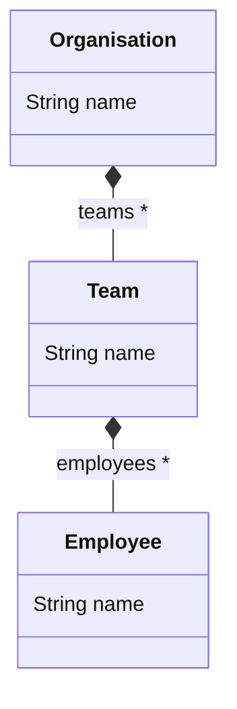
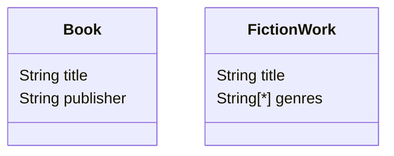
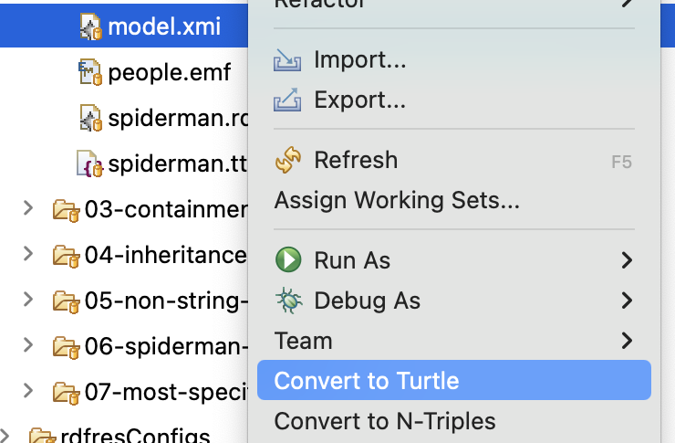

# Epsilon EMC driver for RDF-backed EMF models

!!! tip "Available from version 2.9"

Epsilon can integrate with the [Apache Jena](https://jena.apache.org/) library to load and save EMF-based models from/to RDF formats, such as [Turtle](https://www.w3.org/TR/turtle/), [N-Triples](https://www.w3.org/TR/n-triples/), or [RDF/XML](https://www.w3.org/TR/rdf-syntax-grammar/).

Some of the advantages of this representation include:

* The RDF graph can include more information than that in the EMF metamodels: this information is accessible through dedicated APIs, and kept upon saving.
* The information about a single `EObject` can be broken up across multiple RDF files, e.g. due to some of the information being more sensitive. This is transparent to EMF.
* A subset of the W3C Web Ontology Language ([OWL](https://www.w3.org/OWL/)) is supported for inference, e.g. to decide on the `EClass`es that a given RDF resource conforms to by looking at its features, rather than relying on a declared type (i.e. "duck-typing"). Specifically, Epsilon integrates the [built-in Jena RDFS inference](https://jena.apache.org/documentation/ontology/#creating-ontology-models).

You can continue reading details below, or you can dive straight into these examples:

* [Turtles](https://github.com/eclipse-epsilon/epsilon/tree/main/examples/org.eclipse.epsilon.examples.rdf.emf.turtles): shows how a Turtle file can hold information outside the metamodel, and how this [can be accessed via EOL](#escaping-to-rdf).
* [Book](https://github.com/eclipse-epsilon/epsilon/tree/main/examples/org.eclipse.epsilon.examples.rdf.emf.book): shows how a single RDF node can [become multiple `EObject`s](#multiple-eobjects-from-same-rdf-node).
* [OrgChart](https://github.com/eclipse-epsilon/epsilon/tree/main/examples/org.eclipse.epsilon.examples.rdf.emf.orgchart): shows how the information about a certain `EObject` can be broken up into multiple RDF documents (perhaps requiring different levels of access).
* [ETL](https://github.com/eclipse-epsilon/epsilon/tree/main/examples/org.eclipse.epsilon.examples.rdf.emf.etl): shows how it is possible to [control the IRIs](#specifying-custom-rdf-iris-during-instance-creation) of the RDF nodes created when new `EObject`s are instantiated, and how the driver can create [new RDF files from scratch](#creating-a-model-from-scratch).
* [Picto](https://github.com/eclipse-epsilon/epsilon/tree/main/examples/org.eclipse.epsilon.examples.rdf.emf.picto): demonstrates an RDF-aware visualisation that can combine information from inside and [outside](#escaping-to-rdf) the relevant metamodels.
* [Maven](https://github.com/eclipse-epsilon/epsilon/tree/main/examples/org.eclipse.epsilon.examples.rdf.emf.maven): shows how to query an RDF file via Epsilon from a plain Java environment, only using Maven to fetch the dependencies.

## EMF-RDF mapping

The interoperability implements a mapping between RDF and EMF inspired by the OMG [MOF2RDF](https://www.omg.org/spec/MOF2RDF/1.0/About-MOF2RDF) specification, with some simplifications.

We will use a small example to illustrate the mapping.
Suppose we had this minimal Ecore metamodel:



We could describe a small development team in Turtle like this:

```
@base <http://my.org/> .
@prefix rdf: <http://www.w3.org/1999/02/22-rdf-syntax-ns#> .
@prefix rdfs: <http://www.w3.org/2000/01/rdf-schema#> .
@prefix orgc: <http://york.ac.uk/emf-rdf/examples/orgchart#> .

<#organisation>
  a orgc:Organisation ;
  orgc:name "My Organisation" ;
  orgc:teams ( <teams#dev> ) .

<teams#dev>
  a orgc:Team ;
  orgc:name "Development Team" ;
  orgc:employees <employees#1234> ;
  orgc:employees <employees#2345> .

<employees#1234>
  a orgc:Employee ;
  orgc:name "John Doe" .

<employees#2345>
 a orgc:Employee ;
 orgc:name "Jane Sue" .
```

The mapping is as follows:

* A subject `s` is an `EObject` if there is a `<s rdf:type ePackage:eClass>` triple for it, where `ePackage` is the EPackage namespace URI plus `#` or `/`, and `eClass` is the name
of the EClass in the EPackage that it conforms to.
* An EObject subject can have `<s ePackage:eFeature value>` triples for the values of its `EFeature`s, where `ePackage` follows the same rules as above, and `eFeature` is the name of the feature.
  * We currently assume that a given EClass cannot have two features with the same name.
  * The value can be other RDF resources (for `EReference`s), or literales (for `EAttribute`s).
  * Multi-valued features are supported via [containers](https://www.w3.org/TR/rdf-schema/#ch_containervocab) or [lists](https://www.w3.org/TR/rdf-schema/#ch_collectionvocab).

Note: the mapping allows for the same RDF resource to be deserialised into [multiple `EObject`s](#multiple-eobjects-from-same-rdf-node), if there are multiple `rdf:type` statements from disjoint `EClass` hierarchies.

## EMF-RDF resource file (`.rdfres`)

The RDF EMC driver is based on a [custom EMF resource](https://github.com/eclipse-epsilon/epsilon/tree/main/plugins/org.eclipse.epsilon.rdf.emf) which operates from dedicated [YAML](https://yaml.org/)-based configuration files with the `.rdfres` extension.

Assuming the above Turtle file was saved in `myorg.ttl`, a minimal `.rdfres` that Epsilon would be able to load and save from would be:

```yaml
dataModels:
  - myorg.ttl
```

The available keys in the `.rdfres` format are as follows:

* `dataModels` (mandatory): list of one or more locations containing the statements for the `EObject`s.
  These will be typically relative paths from the `.rdfres` to the relevant RDF files.
  Epsilon supports all the file formats [implemented by Jena](https://jena.apache.org/documentation/io/), as it uses its RIOT system for I/O.
* `defaultModelNamespace` (optional): the [default namespace](#default-namespace-for-new-eobjects) to use for the underlying RDF resources when creating new `EObject`s.
* `multiValueAttributeMode` (optional): string indicating the default RDF data structure to use for newly set [multi-valued features](#multi-valued-features).
* `schemaModels` (optional): list of zero or more locations containing the OWL schemas to be used for inference over the union graph formed by all the data models. `EObject`s will not be deserialised from these locations.
* `validationMode` (optional): string indicating the [internal consistency checking](#internal-consistency-checking) mode to be used. By default, no checking is done.

### Default namespace for new EObjects

Creating an `EObject` in an RDF-backed model will result in creating an RDF node (specifically, an RDF resource), which needs an IRI (a [generalised URI](https://www.rfc-editor.org/rfc/rfc3987)).

Epsilon computes the IRI following these steps:

1. If the `defaultModelNamespace` key has been set in the `.rdfres`, combine it with an UUID.
     * The default model namespace IRI must be absolute, e.g. by starting with `file://` or `http://`: invalid IRIs will be ignored, going to the next step.
     * For example, if the namespace was set to `http://foo/bar/example#`, one possible IRI for the RDF resource backing a new `EObject` would be `http://foo/bar/example#_6sDDMIgJEfC2g6UdYdL1hg`.
1. If a valid default model namespace is not provided in the `.rdfres` file, combine the IRI mentioned in the blank prefix (`PREFIX : <IRI>`) of the first data model with a UUID.
1. If no blank prefix is provided either, combine the IRI of the first data model with a UUID.

### Internal consistency checking

Jena can perform some consistency checks between the statements in the RDF graph, and the OWL classes mentioned in the schema models.
These checks can be controlled through the `validationMode` key.
The following validation modes are available :

- `none`: no checking is done. This is the default, for performance.
- `jena-valid`: validation passes if the model has no internal inconsistencies, even though there may be some warnings.
- `jena-clean`: validation passes if the model has no internal inconsistencies and there are no warnings.

### Multi-valued features

`EFeature`s with a maximum cardinality greater than 1 ("multi-valued features") are represented through RDF containers or RDF lists.
The `unique` and `ordered` flags are supported: uniqueness checks are delegated to the EMF `EList`s, which ensure that the same element cannot be present multiple times.

The resource will opt to update the RDF representation of a multi-value attribute based on its current data structure (container/list) in the RDF data model.
However, when there is no existing structure, the data structure will be chosen based on the value of the `multiValueAttributeMode` in the `.rdfres` file:

* `Container` (the default): use RDF containers (Bag or Seq).
* `List`: use RDF lists.

## Escaping to RDF

The EMF resource underlying this EMC driver maintains a two-way mapping between the EMF `EObject`s that have been deserialised from the RDF graph, and their underlying RDF nodes.
This means that it is possible to go from the `EObject` to the RDF node, and back:

- If we have a model called `M` and an `EObject` variable named `eob`, we can use `M.resource.getRDFResource(eob)` to obtain the underlying Jena RDF [Resource](https://jena.apache.org/documentation/javadoc/jena/org.apache.jena.core/org/apache/jena/rdf/model/Resource.html) object.
- Likewise, if we have a model called `M` and a Jena `Resource` variable named `rdfRes`, we can use `M.resource.getEObjects(rdfRes)` to obtain the collection of the `EObject`s associated to this resource. Note that while every `EObject` is backed by one RDF resource, a single RDF resource may result in [multiple `EObject`s](#multiple-eobjects-from-same-rdf-node).

The following examples show some of the use cases enabled by this two-way mapping:

* [Turtles](https://github.com/eclipse-epsilon/epsilon/tree/main/examples/org.eclipse.epsilon.examples.rdf.emf.turtles): shows how it is possible to escape to RDF to follow a RDF-only `friendOf` reference between two `EObject`s.
* [Picto](https://github.com/eclipse-epsilon/epsilon/tree/main/examples/org.eclipse.epsilon.examples.rdf.emf.picto): shows how we can write a visualisation that shows both the underlying RDF nodes and the `EObject`s that have been deserialised from them.

## Multiple EObjects from same RDF node

Suppose we had these two `EClass`es from different `EPackage`s:



We could have a set of RDF statements like these:

```
@base <http://eclipse.org/epsilon/rdf/books#> .
@prefix books: <http://eclipse.org/epsilon/rdf/books#> .
@prefix fiction: <http://eclipse.org/epsilon/rdf/fiction#> .
@prefix rdf: <http://www.w3.org/1999/02/22-rdf-syntax-ns#> .

<#quijote>
  books:publisher  "P Ublisher";
  books:title      "El Quijote";
  fiction:genres   ( "Narration" "Picaresque" "Chivalric romance" ) .
```

On top of this data model, we could add a [schema model](https://github.com/eclipse-epsilon/epsilon/blob/main/examples/org.eclipse.epsilon.examples.rdf.emf.book/models/schema.ttl) with the following inference rules:

* A Book is anything with a title and a publisher.
* A FictionWork is anything with a title.
* Book titles are equivalent to FictionWork titles.

The built-in RDFS inference supported by this driver would therefore compute that `<http://eclipse.org/epsilon/rdf/books#quijote>` is both a Book and a FictionWork (where the title of the FictionWork is also "El Quijote").

This means that the same RDF node will be deserialised into multiple `EObject`s, each with its own subset of the information.
Changes to these separate `EObject`s will be persisted to the same underlying RDF node, although re-inferencing is currently not supported (i.e. changing the name of the Book will not change the name of the FictionWork).

To experiment with this behaviour, please consult the [RDF book example](https://github.com/eclipse-epsilon/epsilon/tree/main/examples/org.eclipse.epsilon.examples.rdf.emf.book) in the Epsilon GitHub repository.

## Creating a model from scratch

It is possible to use this EMC driver with `readOnLoad` set to `false` (i.e. without loading an `.rdfres` file).

In this scenario, Epsilon will set up in-memory data models based on the in-memory configuration of the underlying EMF resource.
Given an `RdfEmfModel m` (from the EMC driver), the underlying RDF-backed EMF resource can be obtained via:

```java
RDFGraphResourceImpl resource = (RDFGraphResourceImpl) m.getResource();
```

The in-memory configuration can be then accessed via `resource.getConfig()`.
There are several points to consider about its configuration:

* If no data models have been specified, Epsilon will add a `.ttl` data model based on the URI of the resource (i.e. `file://path/to/file.rdfres` will result in `file://path/to/file.ttl` being created upon save). `platform:` URLs are supported in this way as well when running from the Eclipse IDE.
* No schema models will be used in this scenario: the expectation is that modifying an resource without loading it is for creating brand new graphs, rather than for performing reasoning on existing graphs.
* Saving the resource in this scenario will also write the configuration to the URI of the resource. If this is undesirable, call `resource.setConfigSaved(false)` before saving.

Note that configurations are *not* saved by default for resources that were loaded before any changes were made.
This can be changed by calling `resource.setConfigSaved(true)` before saving.

## Specifying custom RDF IRIs during instance creation

The underlying EMF resource (see [above](#creating-a-model-from-scratch)) supports creating `EObject`s with arbitrary IRIs through its `createInstanceAt(EClass eClass, String iri)` method.

The [ETL example](./examples/org.eclipse.epsilon.examples.rdf.emf.etl/) shows how it can be used in combination with [ETL "to" initializers](https://github.com/eclipse-epsilon/epsilon/issues/125).

## Working with RDF XML literals

RDF supports defining [XML literals](https://www.w3.org/TR/rdf-syntax-grammar/#section-Syntax-XML-literals), whose content is an XML document fragment.
These are parsed by the underlying Jena library as instances of [DocumentFragment](https://docs.oracle.com/javase/8/docs/api/org/w3c/dom/DocumentFragment.html).

If you need to deserialise a property whose values will be XML literals, we recommend defining in your metamodel an EMF `EDataType` whose `instanceClassName` is `DocumentFragment`.
You can then use it as the data type of any relevant attribute.
For example, in the [Eclipse Emfatic](https://eclipse.dev/emfatic/) notation, it would look like this:

```emf
datatype EXMLLiteral : org.w3c.dom.DocumentFragment;

class Requirement {
  attr EXMLLiteral title;
}
```

In modularised Java codebases, accessing this feature via reflection (e.g. from an [Epsilon](https://eclipse.dev/epsilon/) program) may cause an error message like this:

```
module java.xml does not "exports com.sun.org.apache.xerces.internal.dom" to unnamed module
```

In this case, you may need a flag like the following to your JVM options:

```
--add-opens=java.xml/com.sun.org.apache.xerces.internal.dom=ALL-UNNAMED
```

## Converting an XMI file to RDF formats

The "RDF-Based EMF Resource Developer Tools" feature includes converters from XMI to the [Turtle](https://www.w3.org/TR/turtle/) and [N-Triples](https://www.w3.org/TR/n-triples/) serialisation formats for RDF.

To use them, right-click on a file with the `.xmi` or `.model` extensions in the Eclipse "Project Explorer" or "Package Explorer" views, and select the appropriate option:


