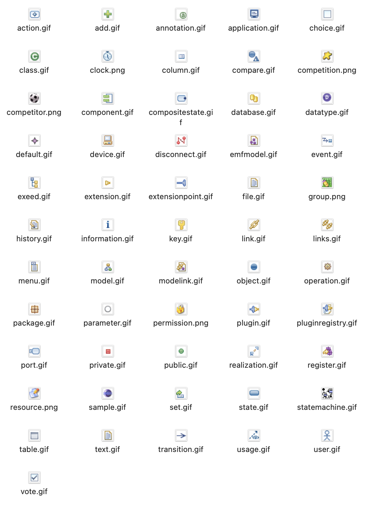

# Exeed (Extended EMF Editor)

Exeed is an extended version of the built-in tree-based reflective editor provided by EMF. The aim of Exeed is to **enable developers to customize the appearance of the editor (labels and icons)** by annotating Ecore metamodels. As a result, developers can enjoy the benefits of a customized editor for their models without needing to generate one and then customize it using Java.

| EMF Reflective Editor | Exeed             |
| ----------------------- | -----             |
|      ||

## Exeed Annotations Keys
The *source* for exeed annotations is `exeed`. Exeed annotations are only supported in `EClass`, `EEnumLiteral` and `EStructuralFeature` elements of the metamodel. For each element the following keys are supported:

### EClass
* `label`: Defines the label that will be used to for the element when it is displayed on all views related to the editor (editing tree, properties view, etc.)
* `referenceLabel`: Defines the label for a reference to an instance of this `EClass` ((e.g. in the properties view).
* `icon`: Defines the icon to use to display alongside the element on all views related to the editor (editing tree, properties view, etc.). If specified, it overrides the `classIcon` annotation.
* `classIcon`: Defines the icon of the instances of the `EClass`.

### EEnumLiteral
* `label`: Defines the label that will be used for the enumeration literal when it is displayed on all views related to the editor (editing tree, properties view, etc.)

### EStructuralFeature
* `featureLabel`: Defines the label that will be used for the structural feature when it is displayed on all views related to the editor (editing tree, properties view, etc.)

## Exeed Annotations Values
All keys, except for `classIcon`, accept an EOL script as their value. This allows labels and icons to be dynamically allocated based on the properties of the instance. The EOL script is evaluated in the context of each instance, that is, the current instance can be accessed via the `self` keyword. Further, all other model elements are accessible via navigation (i.e. references from the instance) or by getting all elements of a type (e.g. `MyType.all`). 

For the `icon` and `classIcon` keys the expected value is the name of one of the [built-in icons](https://github.com/eclipse-epsilon/epsilon/tree/main/plugins/org.eclipse.epsilon.dt.exeed/icons) available in Exeed (excluding the file extension -- i.e. `model` instead of `model.gif`), or a fully-qualified Eclipse platform URI (see the `Package` class in the metamodel below for an example).

=== "Built-in icons"
    
    

## Example
The images show the tree view of an OO model with the default EMF reflective editor (left) and Exeed (right).


Below is the annotated OO metamodel (in Emfatic) that was used to obtain the Exeed result above (the example is available from the [examples](https://github.com/eclipse-epsilon/epsilon/tree/main/examples/org.eclipse.epsilon.examples.exeedoo) folder of the Git repository):

```emf
{{{ example("org.eclipse.epsilon.examples.exeedoo/OO.emf", false) }}}
```

## Resources
- [Article: Inspecting EMF Models with Exeed](../articles/inspect-models-exeed)