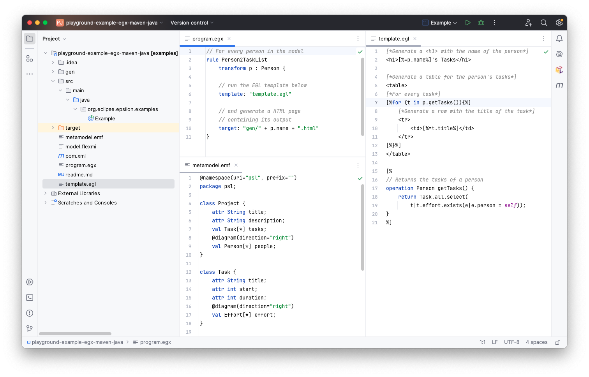
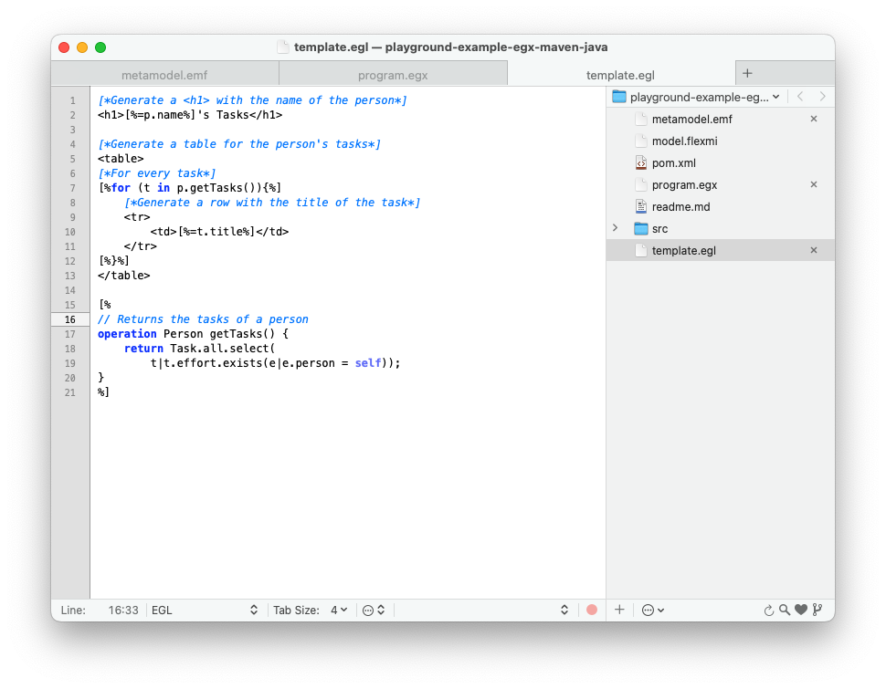

# Getting Started with Epsilon

Epsilon provides a set of languages and tools for tasks such as [model-to-text transformation](doc/egl.md), [model-to-model transformation](doc/etl.md), [model validation](doc/evl.md) (all of which extend [the same core language](doc/eol.md)), [model editing](doc/flexmi/index.md), [weaving](doc/modelink/index.md) and [visualisation](doc/picto/index.md). While some Epsilon tools are [Eclipse IDE plugins](#epsilon-in-eclipse), most of Epsilon does not depend on the Eclipse IDE and can be used from standard Java applications and from Maven/Gradle builds.

!!! info "New to Model-Based Software Engineering?"

	If you are a newcomer to model-based software engineering and the Eclipse modelling ecosystem, you may find [this series of lectures](https://www.youtube.com/playlist?list=PLRwHao6Ue0YUecg7vEUQTrtySIWwrd_mI) useful.

## Trying Epsilon in the Playground

You can try most Epsilon languages in the online [Epsilon Playground](playground/index.html), without needing to download or install anything.

## Using Epsilon as a Java library

The execution engines of Epsilon's languages, the [Flexmi](doc/flexmi/index.md) parser, and drivers for [EMF](doc/articles/index.md#epsilon-and-emf-models), [UML](../doc/articles/profiled-uml-models), [XML](doc/articles/plain-xml/index.md) and [Excel](doc/articles/excel/index.md) are available as standard Java libraries through [Maven Central](https://central.sonatype.com/namespace/org.eclipse.epsilon). To get started with parsing and executing Epsilon programs from your Java application:

- Go to the [Epsilon Playground](playground/index.html) and select one of the examples;
- Click the `Download` button and select `Java (Maven)` or `Java (Gradle)` from the window that pops up to download a zipped copy of the example. The downloaded zip file includes an `Example` Java class as well as a `pom.xml`/`build.gradle` file with all the Epsilon dependencies;
- Import the example in your favourite Java IDE (e.g. Eclipse, IntelliJ, VS Code) and run the `Example` class;
- Alternatively, follow the instructions in the `readme.txt` to run the example from command line (you only need to have Java and Maven/Gradle installed);
- Read [this article](doc/articles/run-epsilon-from-java.md) that introduces Epsilon's Java API.

## Epsilon in Maven/Gradle Builds

On some occasions you may need to include model management tasks in your build/CI pipeline (e.g. to validate a model and generate code from it). For such scenarios, Epsilon provides Ant tasks that can be used in the context of Maven and Gradle builds. To get started with running Epsilon from Maven/Gradle builds:

- Go to the [Epsilon Playground](playground/index.html) and select one of the examples;
- Click the `Download` button and select `Maven` or `Gradle` from the window that pops up to download a zipped copy of the example. The downloaded zip file includes a `pom.xml`/`build.gradle` file with all the Epsilon dependencies and the respective Epsilon Ant tasks;
- Follow the instructions in the `readme.txt` to run the example from command line (you only need to have Java and Maven/Gradle installed).

## Epsilon in Eclipse

Epsilon provides a rich set of Eclipse plugins for editing, running, [profiling](doc/articles/profiling/index.md) and [debugging](doc/articles/debugger.md) model management programs. It also includes tools for [editing](doc/flexmi/index.md), [weaving](doc/modelink/index.md) and [visualising](doc/picto/index.md) models. You can [install these tools](download/index.md) through Epsilon's update site or through the Eclipse Installer.

## Epsilon in other IDEs/Editors

Support for syntax highlighting Epsilon programs, Flexmi models and [Emfatic](https://eclipse.org/emfatic) metamodels is available for the following IDEs and editors, beyond Eclipse.

|  |  |
| ------ | ---------- |
| [VS Code](doc/articles/vscode/index.md) |  |
| [IntelliJ](https://github.com/epsilonlabs/epsilon.tmbundle?tab=readme-ov-file#importing-in-intellij) |  |
| [Sublime](https://github.com/epsilonlabs/sublime) |  |
| [TextMate](https://github.com/epsilonlabs/epsilon.tmbundle?tab=readme-ov-file#importing-in-textmate) |  |
