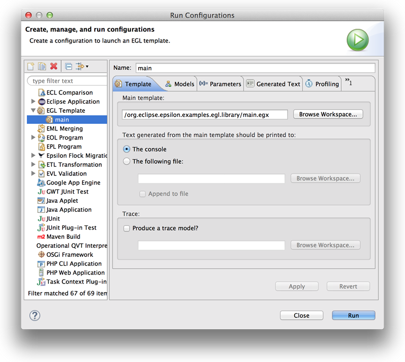
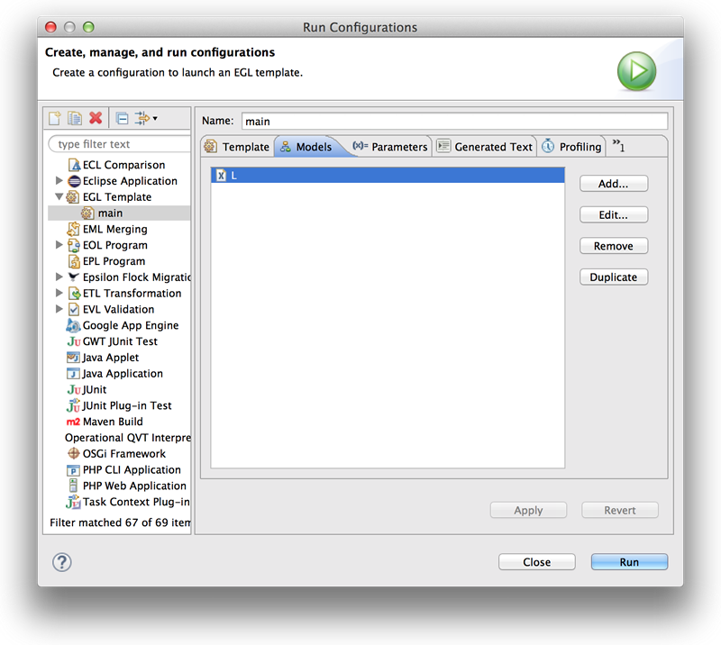
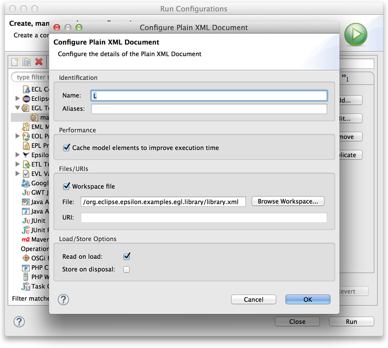

# Code Generation Tutorial with EGL
EGL is a template-based language that can be used to generate code (or any other kind of text) from different types of models supported by Epsilon (e.g. EMF, UML, XML). This example demonstrates using EGL to generate HTML code from the XML document below.

```xml
<library>
  <book title="EMF Eclipse Modeling Framework" pages="744" public="true">
    <id>EMFBook</id>
    <author>Dave Steinberg</author>
    <author>Frank Budinsky</author>
    <author>Marcelo Paternostro</author>
    <author>Ed Merks</author>
    <published>2009</published>
  </book>
  <book title="Eclipse Modeling Project: A Domain-Specific Language (DSL) Toolkit" 
    pages="736" public="true">
    <id>EMPBook</id>
    <author>Richard Gronback</author>
    <published>2009</published>
  </book>
  <book title="Official Eclipse 3.0 FAQs" pages="432" public="false">
    <id>Eclipse3FAQs</id>
    <author>John Arthorne</author>
    <author>Chris Laffra</author>
    <published>2004</published>
  </book>
</library>
```
 
More specifically, we will generate one HTML file for each `<book>` element that has a `public` attribute set to `true`. Below is an EGL template (`book2page.egl`) that can generate an HTML file from a single `<book>` element. For more details on using EGL's expression language to navigate and query XML documents, please refer to [[../plain-xml/|this article]].
 
```egl
<h1>Book [%=index%]: [%=book.a_title%]</h1>

<h2>Authors</h2>
<ul>
[%for (author in book.c_author) { %]
  <li>[%=author.text%]
[%}%]
</ul>
```
 
The template above can generate one HTML file from one `<book>` element. To run this template against '''all''' `<book>` elements anywhere in the XML document, and generate appropriately-named HTML files, we need to use an EGX co-ordination program such as the one illustrated below (`main.egx`). The `Book2Page` rule of the EGX program will `transform` every `<book>` element (`t_book`) that satisfies the declared `guard` (has a `public` attribute set to `true`), into a `target` file, using the specified `template` (`book2page.egl`). In addition, the EGX program specifies a `Library2Page` rule, that generates an HTML (index) file for each `<library>` element in the document.

```egx
rule Book2Page 
  transform book : t_book {
  
  // We only want to generate pages
  // for books that have their public
  // attribute set to true
  guard : book.b_public
  
  parameters {
    // These parameters will be made available
    // to the invoked template as variables
    var params : new Map;
    params.put("index", t_book.all.indexOf(book) + 1);
    return params;
  }
  
  // The EGL template to be invoked
  template : "book2page.egl"
  
  // Output file
  target : "gen/" + book.e_id.text + ".html"
  
}

rule Library2Page 
  transform library : t_library {
  
  template : "library2page.egl"
  
  target : "gen/index.html"
}
```
 
For completeness, the source code of the `library2page.egl` template appears below.
 
```egl
<h1>Books</h1>

<ul>
[%for (book in library.c_book.select(b|b.b_public)) { %]
  <li><a href="[%=book.e_id.text%].html">[%=book.a_title%]</a>
[%}%]
</ul>
```
 
## Running the Code Generator from Eclipse
Screenshots of the Eclipse run configuration appear below. The complete source for this example is available [[../../../examples/index.php?example=org.eclipse.epsilon.examples.egl.library|here]].






 
## Running the Code Generator from Java
 
The following snippet demonstrates using Epsilon's Java API to parse the XML document and execute the EGX program. The complete source for this example is available [here](../../../examples/index.php?example=org.eclipse.epsilon.examples.egl.library) (please read `lib/readme.txt` for instructions on how to obtain the missing Epsilon JAR). 

```java
import java.io.File;

import org.eclipse.epsilon.egl.EglFileGeneratingTemplateFactory;
import org.eclipse.epsilon.egl.EgxModule;
import org.eclipse.epsilon.emc.plainxml.PlainXmlModel;

public class App {
  
  public static void main(String[] args) throws Exception {
    
    // Parse main.egx
    EgxModule module = new EgxModule(new EglFileGeneratingTemplateFactory());
    module.parse(new File("main.egx").getAbsoluteFile());
    
    if (!module.getParseProblems().isEmpty()) {
      System.out.println("Syntax errors found. Exiting.");
      return;
    }
    
    // Load the XML document
    PlainXmlModel model = new PlainXmlModel();
    model.setFile(new File("library.xml"));
    model.setName("L");
    model.load();
    
    // Make the document visible to the EGX program
    module.getContext().getModelRepository().addModel(model);
    // ... and execute
    module.execute();
  }
  
}  
```
