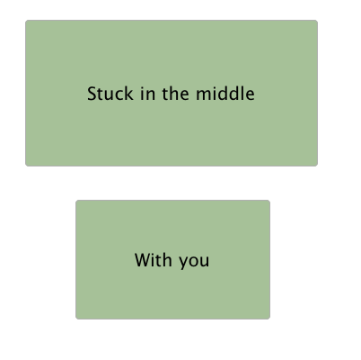

# EuGENia: Nodes with centred content

This recipe shows how to create nodes in your GMF editor whose contents are centred both horizontally and vertically. The resulting editor will produce nodes like this:



We'll start with the following metamodel and EuGENia annotations:

```emf
@namespace(uri="www.eclipse.org/epsilon/examples/widgets", prefix="w")
package widgets;

@gmf.diagram
class System {
   val Widget[*] widgets;
}

@gmf.node(label="name", label.icon="false")
class Widget {
   attr String[1] name;
}
```

In this case, we only have one child node (the label for the node). We need to add a polishing transformation to our project (described in more detail in [this article](../eugenia-polishing/)) to use a grid layout and specify the appropriate layout data for the label. In a file named ECore2GMF.eol, place the following code:

```eol
var shape = findShape('WidgetFigure');
shape.layout = new GmfGraph!GridLayout;

var label = shape.children.first;
label.layoutData = new GmfGraph!GridLayoutData;
label.layoutData.grabExcessVerticalSpace = true;
label.layoutData.grabExcessHorizontalSpace = true;

operation findShape(name : String) {
  return GmfGraph!Shape.all.selectOne(s|s.name = name);
}
```

If we have multiple child nodes, we may want to use a custom layout manager instead to achieve the centring. The polishing transformation will have to add the custom layout to our widget figure, and the ECcore2GMF.eol file will now look like this:

```eol
findShape('WidgetFigure').layout = createCentredLayout();

operation findShape(name : String) {
  return GmfGraph!Shape.all.selectOne(s|s.name = name);
}

operation createCentredLayout() : GmfGraph!CustomLayout {
  var layout = new GmfGraph!CustomLayout;
  layout.qualifiedClassName = 'widgets.custom.layouts.CentredLayout';
  return layout;
}
```

Notice that the layout specifies a qualified class name of `widgets.custom.layouts.CentredLayout`. We must create a class with that name, which implements the `LayoutManager` of draw2d. We'll use [this](http://eclipse.org/epsilon/doc/articles/eugenia-nodes-with-centred-layout/CentredLayout.java) exemplar implementation of widgets.custom.layouts.CentredLayout and place it in a `widgets.custom` plug-in project. We must add a dependency for the `widgets.custom` plugin project to the `widgets.diagram` project generated by GMF.

For more details, please check the `org.eclipse.epsilon.eugenia.examples.centred` example projects at the Epsilon Git repository.