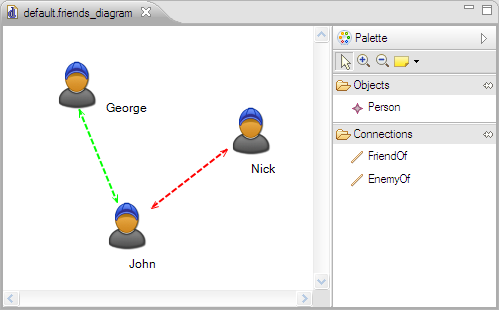

# EuGENia: Nodes with images instead of shapes

This recipe shows how to create nodes in your GMF editor that are
represented with images (png, jpg etc.) instead of the standard GMF
shapes (rectangle, ellipse etc.). We'll use the simple `friends`
metamodel as demonstration:

```emf
@namespace(uri="friends", prefix="")
package friends;

@gmf.diagram
class World {
    val Person[*] people;
}

@gmf.node(figure="figures.PersonFigure", label.icon="false", label="name", label.placement="external")
class Person {
    attr String name;
    
    @gmf.link(width="2", color="0,255,0", source.decoration="arrow",
      target.decoration="arrow", style="dash")
    ref Person[*] friendOf;
    
    @gmf.link(width="2", color="255,0,0", source.decoration="arrow", 
      target.decoration="arrow", style="dash")
    ref Person[*] enemyOf;
}
```

We define a custom figure for Person (`figure="figures.PersonFigure"`)
and also specify that the label should be placed externally to the node
(`label.placement="external"`). Once we have generated our diagram code
we need to go and define the `figure.PersonFigure` class. An example of
an png image-based implementation is available below:

```java
package figures;

import org.eclipse.draw2d.ImageFigure;
import activator.PluginActivator;

/**
 * @generated
 */
public class PersonFigure extends ImageFigure {

    public PersonFigure() {
        super(PluginActivator.imageDescriptorFromPlugin(PluginActivator.ID,
                "images/Person.png").createImage(), 0);
    }

}
```

The PluginActivator extends AbstractUIPlugin, which provides methods for
loading images from within our plug-in:

```java
package activator;

import org.eclipse.core.runtime.Plugin;
import org.eclipse.ui.plugin.AbstractUIPlugin;
import org.osgi.framework.BundleContext;


public class PluginActivator extends AbstractUIPlugin {

  public static final String ID = "friends.figures"; //$NON-NLS-1$


  private static PluginActivator ourInstance;

  public PluginActivator() {}

  public void start(BundleContext context) throws Exception {
    super.start(context);
    ourInstance = this;
  }

  public void stop(BundleContext context) throws Exception {
    ourInstance = null;
    super.stop(context);
  }

  public static PluginActivator getDefault() {
    return ourInstance;
  }
}
```

The result looks like this:



For more details, please check the [full
example](../../../examples/index.php?example=org.eclipse.epsilon.eugenia.examples.friends).
