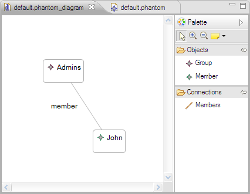
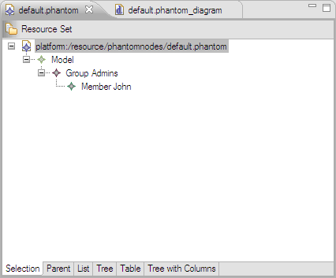

# EuGENia: Phantom nodes in GMF editors

Containment references in Ecore metamodels are usually depicted in GMF as spatial containment (e.g. in the sense that a class is contained inside the figure of a package). However, it is sometimes needed to represent containment references using links instead. To achieve this, GMF provides the notion of *phantom nodes.* EuGENia provides first-class support for phantom nodes in GMF using the *phantom* annotation detail. The following listing provides such an example:

```emf
@namespace(uri="phantom", prefix="phantom")
package phantom;

@gmf.diagram
class Model extends NamedElement {
   val Group[*] groups;
}

class NamedElement {
   attr String name;
}

@gmf.node(label="name")
class Group extends NamedElement {
   @gmf.link(label="member")
   val Member[*] members;
}

@gmf.node(label="name", phantom="true")
class Member extends NamedElement {

}
```

In this example, a Model contains many groups and a Group contains many members. To represent the Group.members containment reference as a normal link, we the phantom detail of the gmf.node annotation of Member to true and add a gmf.link anotation to Group.members. The result looks like this:




