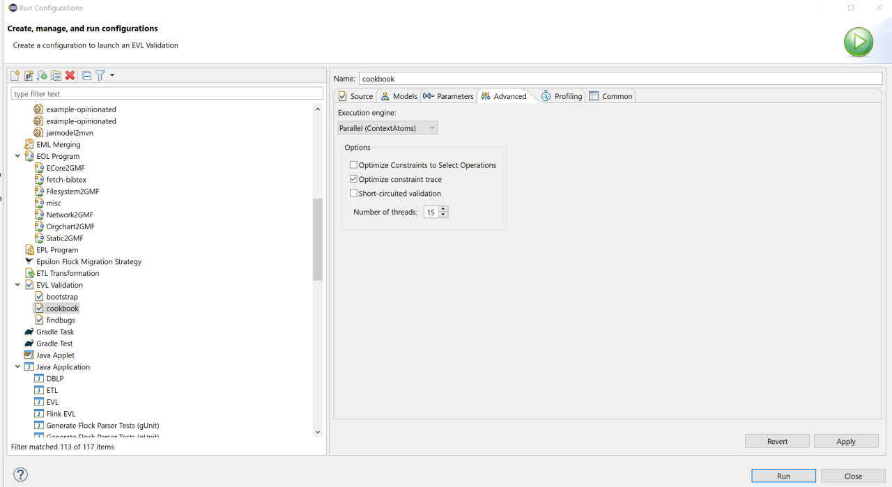
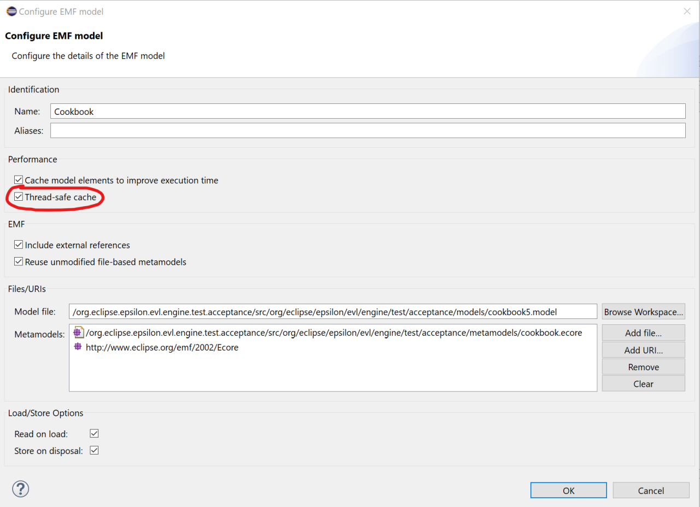

# Multi-threaded execution of Epsilon programs

Some of Epsilon's languages support parallel execution, which can leverage multiple hardware threads to improve performance. To enable this, head to the **Advanced** tab and select a parallel implementation. Where there are multiple implementations, prefer the "Elements" or "Atom" ones. An "Atom" is a tuple of a module element and model element, so for example a "ContextAtom" in EVL is context-element pair - that is, the granularity of parallelisation will be at the model element level (one job for every model element).



Note that the modelling technology must also be able to handle concurrent query operations. Most modelling technologies will likely be supported for read-only model management tasks such as validation and code generation, however some which rely on external tools e.g. Simulink cannot handle concurrent operations. In any case, since most models support caching, the cache must be set up to support concurrency. You should ensure that the appropriate concurrency support option is checked in the model configuration.



Note that when choosing a parallel implementation, first-order operations such as `select`, `exists` etc. will also be parallelised automatically where appropriate. This applies in particular to the parallel EOL implementation.

## Annotation-based parallelism

In cases where an "Annotation-based" implementation is available, you can choose which rules are parallelised with the `@parallel` annotation. For example in EVL:

```evl
context ModelElementType {
  @parallel
  constraint Invariant {
    check {
      // ...
    }
  }
```

If further control is required, you can also choose whether a rule will be executed in parallel on a per-element basis using an executable annotation. This allows you to write a Boolean EOL expression to determine whether a given model element should be executed in parallel for the annotated rule. You can access the model element in the annotation with `self` as usual, and also any operations or variables in scope. Any rules not annotated will be executed sequentially.

```evl
pre {
  var parallelThreshold = 9001;
}
context ModelElementType {
  $parallel self.children.size() > parallelThreshold;
  constraint Invariant {
    check {
      // ...
    }
  }
```

## Limitations
Currently Epsilon does not support assignment of extended properties when executing in parallel. Parallel operations also cannot be nested.
