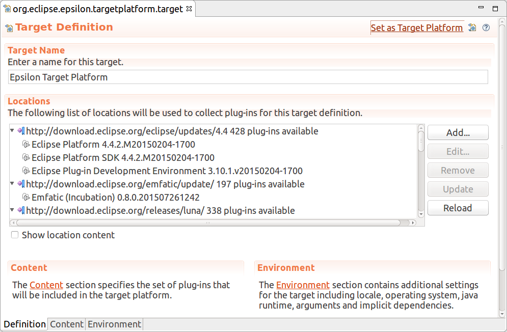
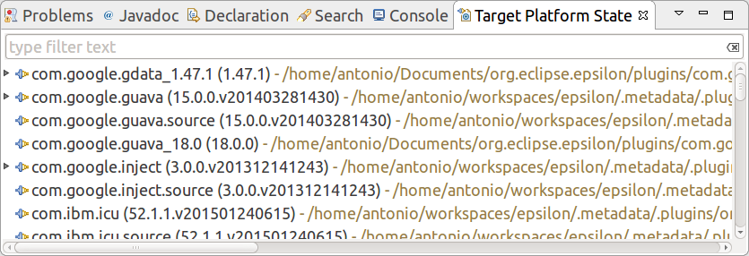

# Managing the target platform

Epsilon stable and interim releases are built using [Eclipse Tycho](https://eclipse.org/tycho/), which repurposes [Apache Maven](http://maven.apache.org/) for automating the build of Eclipse plugins, features and update sites. Maven builds are launched automatically by the [Epsilon Hudson HIPP instance](https://hudson.eclipse.org/epsilon/) whenever a change in the `master` branch of the Epsilon Git repository is detected.

Tycho requires defining a "target platform" with the Eclipse plugins and features that Epsilon should be compiled against. In the case of Epsilon, this target platform will usually include EMF, GMF, the Eclipse IDE and PDE, Emfatic, and then any other third-party components that might be useful (e.g. Sirius or Papyrus). The target platform is stored in the [plugins/org.eclipse.epsilon.targetplatform.target](http://git.eclipse.org/c/epsilon/org.eclipse.epsilon.git/tree/plugins/org.eclipse.epsilon.targetplatform/org.eclipse.epsilon.targetplatform.target) project.

The target platform is an XML file that lists features or plugins from one or more update sites. It can be edited by hand, but it is rather unwieldy, so it is better to open it from Eclipse. A working Internet connection is needed to edit these files. Once you open the file, Eclipse will spend some time downloading features and plugins from the update sites and resolving dependencies. After it is done, you should see something like this:

In the picture, we can see three update sites (main Luna release, Luna updates and Emfatic), with some features pulled from them. In general, it is better to define target platforms at the feature level rather than at the plugin level, as they tend to be more stable across releases: it's better to pull in a few extra plugins than have the whole thing break because of a single missing plugin.

One important restriction is that even though Eclipse allows for adding local folders as part of the target platform, these are rejected by Tycho. Tycho only supports URL-based update sites in target platform definitions: should you need a custom plugin for building Eclipse, it will have to be placed in an update site and hosted somewhere. If it is part of a well-known open source project, it may make sense to see if one of the [Orbit update sites](https://www.eclipse.org/orbit/) already has it: additionally, those bundles have already gone through the legal processes set by the Eclipse Foundation.

To check if the target platform has everything we need, we should follow these steps:

1. Import the rest of the Epsilon source code into our workspace.
2. Go to the target platform editor after resolution is done and click on "Set Target Platform".
3. Wait for everything to be rebuilt, and check there are no compilation errors due to missing dependencies.

Should we miss some dependencies, we can either "Edit..." one of the locations to include more things from it, or we can "Add..." a location with new things. It is OK to add the same location multiple times. Keep in mind that recent versions of Eclipse have an issue with the "Edit..." button where you will need to wait a few seconds until Eclipse ticks again all the things we previously had from that location - if you don't wait, you will lose the features that were previously selected!

After any changes are made to the target platform definition and saved, Eclipse will take a bit to resolve again everything. It's a good idea to make changes in small increments, in case there is a resolution problem and the definition has to be rolled back.

Even if everything compiles, it's a good idea to double check in the "Content" tab if the specific plugins and versions we wanted are in there. Sometimes, it may not be obvious which features contribute which plugin.

Once the target platform has been set through "Set Target Platform", it may also make sense to use the "Target Platform State" view to find plugins that are missing dependencies. The target platform resolves if we have all the things we asked for, but it does not check that the plugins we are fetching have all their dependencies sorted out.

This view allows you to search through the contents of the current target platform, and to check how dependencies have been resolved between the plugins. There is a drop down menu with an option for only showing unresolved plugins: a good target platform should never have any listed in there, unless they happen to be platform-specific. For instance, it makes sense if a Mac-specific plugin (e.g. a Mac binary for launching Eclipse) does not resolve in a developer's Linux machine.

Once the target platform has been revised and we have double-checked that everything compiles fine and that there are no unresolved plugins in the "Target Platform State" view, we should do one last check before pushing the changes to Git: making sure the Tycho build still works. To do so, we should go to the main folder of the Epsilon Git repository and run this command, assuming we have a recent version of Maven 3 installed and available from our `PATH`:

    mvn clean install

If this command succeeds, it is ready to be pushed. Push the changes, wait until the build succeeds in the [Epsilon Jenkins instance](https://ci.eclipse.org/epsilon/job/interim-kubernetes/job/master/) (Hudson checks every 5 minutes or so for changes), and then you're done!