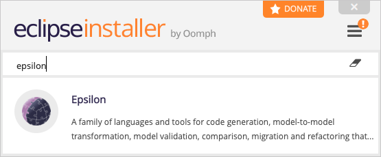

# Eclipse Epsilon

Epsilon is a family of languages and tools for code generation, model-to-model transformation, model validation, comparison, migration and refactoring that work out of the box with EMF, UML, Simulink, XML and other types of models. Epsilon is licensed under the [Eclipse Public License 2.0](https://www.eclipse.org/legal/epl-2.0/).

## Installation

Download the [Eclipse Installer](https://www.eclipse.org/downloads/packages/installer) and select Epsilon. Note that you will need a Java Runtime Environment installed on your system. 

## Why Epsilon?
- **One syntax to rule them all:** All languages in Epsilon build on top of a [common expression language](doc/eol) which means that you can reuse code across your model-to-model transformations, code generators, validation constraints etc.
- **Integrated development tools:**  All languages in Epsilon are supported by editors providing syntax and error highlighting, code templates, and graphical tools for configuring, running, debugging and profiling Epsilon programs. 
- **Documentation, Documentation, Documentation:** More than 30 articles, 15 screencasts, 20 examples, and a 238-page free e-book are available to help you get from novice to expert.